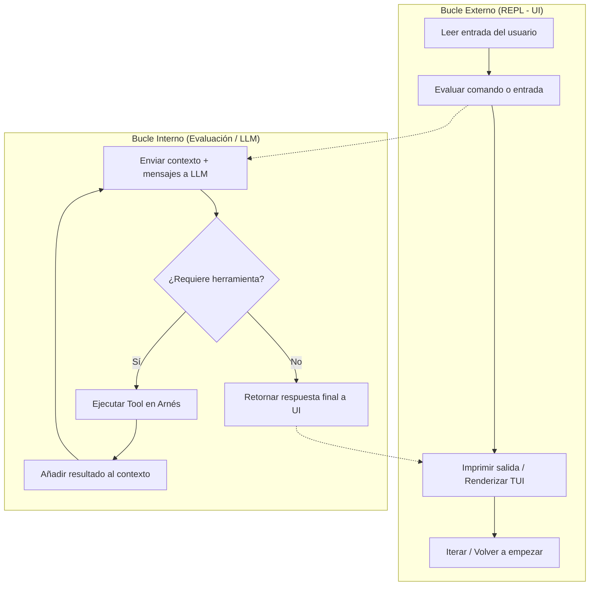
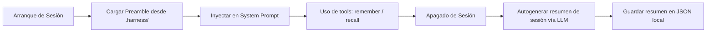

# Análisis — Construyendo un Arnés de IA desde Cero

> [!note] Fuente
> A diferencia de los demás "Análisis" (resúmenes de videos), esta nota es el **análisis técnico de un repositorio de código**: [betta-tech/byo-coding-agent](https://github.com/betta-tech/byo-coding-agent), un arnés de agente didáctico escrito en Go. Las referencias a archivos (`internal/agent/agent.go`, etc.) apuntan al clon local en `external/byo-coding-agent/` — carpeta excluida del repo por `.gitignore`; para seguir el código hay que clonarlo primero (ver [[Recursos externos]]).

Este documento presenta el análisis técnico y conceptual del repositorio de referencia `byo-coding-agent`, el cual implementa un arnés de agente de desarrollo de software completo y extensible escrito en Go. El objetivo de este análisis es entender cómo se construye la capa core (el cerebro y el bucle de ejecución) de un agente inteligente, abstrayéndose de los proveedores de LLM y exponiendo capacidades avanzadas de gobernanza, subagentes dinámicos, memoria persistente y control de contexto.

Para el concepto paraguas que generaliza este diseño —trigger, goal, state, action policy, observation parser, termination y memory update— ver [[Agent Loop Engineering]].

---

## 1. La Arquitectura del Bucle Dual (Agent Loop)

En el desarrollo de agentes cognitivos, la interacción se modela a través de un **bucle de ejecución dual** inspirado en el *game loop* de los videojuegos (Read-Eval-Print-Loop o REPL). Este sistema separa la interacción con el usuario (hilo de interfaz) de la ejecución autónoma y recursiva de herramientas.



### El Bucle Externo (REPL)
Modelado en `main.go` mediante la librería de interfaces de terminal (TUI) **Bubble Tea** de Charm:
1. **Read**: El usuario escribe un prompt en la caja de texto.
2. **Eval**: Se interceptan comandos especiales (como `/debug`, `/compact`, `/provider`) y las entradas generales se delegan al agente.
3. **Print**: La interfaz muestra en tiempo real la salida del asistente o los logs de las herramientas a través de canales de comunicación asíncronos.
4. **Loop**: Se restablece el estado para esperar una nueva orden.

### El Bucle Interno (Evaluation Loop)
Ubicado en `internal/agent/agent.go`, implementa la recursividad del modelo:
- Se inicia con el método `Send(ctx, prompt)`.
- En cada turno, el agente envía el historial compactado al modelo y espera su respuesta.
- Si el modelo retorna un bloque de tipo `tool_use`, el bucle interno **no devuelve el control al usuario**. En su lugar:
  1. Ejecuta la herramienta de forma determinista en el arnés local.
  2. Empaqueta el resultado en un bloque de tipo `tool_result`.
  3. Adjunta los resultados al historial con el rol de usuario y realiza otra llamada a la LLM.
- Este proceso se repite hasta que el modelo decide detenerse (`StopReason` diferente de `api.StopToolUse` o sin más llamadas a herramientas) o hasta que se alcanza el límite de turnos (`MaxTurns`, por defecto 50 en el agente raíz).

---

## 2. Abstracción y Polimorfismo: La Capa de Proveedores

Para evitar el acoplamiento rígido con el SDK de un proveedor de IA (como Anthropic o OpenAI), el arnés introduce un puerto polimórfico en `internal/provider/provider.go`:

```go
type Provider interface {
	Send(ctx context.Context, messages []api.Message, tools []api.ToolDef) (api.Response, error)
	Model() string
	SetModel(name string)
}
```

Esta interfaz traduce las estructuras internas e independientes del arnés (`api.Message`, `api.ToolDef` y `api.Response`) a las llamadas a API nativas de cada proveedor:

- **Anthropic Provider** (`internal/provider/anthropic.go`): Mapea llamadas a Claude (por ejemplo, `claude-3-7-sonnet`, `claude-3-5-opus`). Soporta capacidades específicas como el modo *thinking* y traduce bloques multimedia.
- **OpenAI Provider** (`internal/provider/openai.go`): Mapea la API de Chat Completions tradicional a los modelos GPT.
- **Mock Provider** (`internal/provider/mock.go`): Emula respuestas del LLM con payloads deterministas para la suite de pruebas unitarias, evitando costos de red.

> [!NOTE]
> Gracias a este diseño polimórfico, el comando `/provider <nombre>` puede instanciar y cambiar el motor del agente en caliente a mitad de una sesión sin perder el historial de mensajes de la conversación actual.

---

## 3. Gobernanza y Seguridad: Gateway de Permisos

Uno de los mayores riesgos al ejecutar agentes autónomos es que realicen llamadas a herramientas destructivas (como `bash` con `rm -rf` o sobreescriban archivos críticos) sin supervisión. El arnés soluciona esto inyectando un **Gateway de Aprobación** en el método `executeTool` de `internal/agent/agent.go`:

```go
if a.Confirm != nil && !a.Confirm(prompt, detail) {
    debug.Recordfc(reqID, src, debug.LevelWarn, "denied: %s", name)
    return "user denied this tool call", true
}
```

### Características del Sistema de Gobernanza:
1. **Intercepción Síncrona**: Cuando el bucle interno detecta un `tool_use`, suspende la ejecución y envía un mensaje de tipo `ui.ApprovalRequest` a la interfaz Bubble Tea.
2. **Interactividad**: La interfaz física bloquea la terminal del usuario y dibuja un modal interactivo que requiere un consentimiento explícito (`y/n`).
3. **Cálculo de Diferencias (Visualización de Diff)**: Para la herramienta `write_file`, el arnés compara el contenido propuesto por el agente con el estado actual del archivo en el disco y genera un diff unificado (`internal/agent/diff.go`). Este diff se renderiza dentro del modal de aprobación para que el usuario sepa exactamente qué líneas se agregarán o modificarán antes de confirmar la escritura.
4. **Respuesta como Error de Tool**: Si el usuario deniega la operación, el arnés retorna al modelo la respuesta genérica `"user denied this tool call"`, permitiendo que el agente se entere de la restricción y trate de plantear una estrategia alternativa en el siguiente turno.

---

## 4. Subagentes Dinámicos y Delegación

Para mitigar la sobrecarga de contexto en tareas extensas de investigación, el agente implementa el patrón de **Subagentes Dinámicos**.

A través de la herramienta polimórfica `DelegateTool` (`delegate.go`), el modelo raíz puede instanciar un agente secundario especializado (`Research` subagent):

```go
type DelegateTool struct {
	Subagent subagent.Subagent
}
```

### Mecanismo de Delegación:
- **Definición de Herramienta**: El modelo raíz ve la herramienta como `delegate_research` y sabe cuándo usarla gracias a una descripción detallada en su esquema.
- **Ciclo de Vida Aislado**: Cuando se ejecuta la herramienta:
  1. Se instancia un nuevo objeto `agent.Agent` con un subconjunto restringido de herramientas (por ejemplo, únicamente `read_file` para evitar modificaciones accidentales).
  2. Se ejecuta un **bucle interno independiente** para el subagente utilizando la descripción de la tarea como prompt de inicio.
  3. El subagente interactúa recursivamente con la LLM para resolver la investigación. Su salida de texto directa se acumula en silencio para no ensuciar la TUI del usuario.
  4. Una vez terminado, el resultado de texto final se devuelve al agente raíz como si fuera el retorno simple de una herramienta tradicional.

---

## 5. Control de la Ventana de Contexto (Compactación)

A medida que el diálogo progresa y se ejecutan múltiples herramientas, el historial de mensajes se expande y consume tokens rápidamente. Para mitigar la degradación semántica y controlar los costos, el agente utiliza interfaces de compactación (`internal/compact/strategy.go`).

El arnés implementa tres estrategias que se pueden alternar mediante el comando `/compact <estrategia>`:

### 1. Sin Compactación (`NoCompaction`)
Mantiene todos los mensajes de la sesión intactos. Es el comportamiento predeterminado, útil para sesiones cortas.

### 2. Ventana Deslizante (`SlidingWindow`)
Conserva únicamente los últimos $N$ mensajes. 
- *Seam de Seguridad*: Utiliza el método `SafeSplitPoint` para garantizar que la ventana nunca se divida entre un bloque de tipo `tool_use` y su correspondiente `tool_result`, lo que rompería la sintaxis y coherencia esperada por la API del modelo.

### 3. Resumen Semántico (`Summarize`)
Cuando el número de mensajes supera un umbral determinado (`Threshold`), el arnés:
1. Separa los mensajes antiguos de los más recientes (`KeepRecent`).
2. Realiza una llamada en segundo plano a la LLM con un prompt especializado (`defaultSummarizeInstructions`) pasándole el historial antiguo para que genere un resumen conciso (preservando variables, nombres de archivos, decisiones y estados).
3. Reemplaza toda la sección antigua del historial por un único mensaje sintético de tipo usuario con la cabecera `[earlier conversation summary]`.

---

## 6. Sistema de Memoria de Sesiones

A diferencia de las variables del proceso en RAM que se destruyen al cerrar la terminal, el arnés implementa una capa de persistencia simple basada en archivos locales en la carpeta `.harness/` (`internal/memory/sessionfiles.go`).



### Herramientas de Memoria:
- `remember(content, kind, tags)`: Permite al agente persistir hechos importantes, decisiones técnicas o preferencias del usuario detectadas durante la sesión.
- `recall(query)`: Permite al agente buscar semántica o sintácticamente en recuerdos pasados para recuperar contexto histórico.

### Ciclo de Arranque y Cierre:
- **Carga de Preamble**: Al iniciar la aplicación, el almacén lee el archivo de índice JSON y extrae resúmenes estructurados de las sesiones previas. Este preámbulo se concatena al System Prompt inicial.
- **Resumen en Apagado (Auto-Summary)**: Al cerrarse el programa, un manejador diferido (`defer`) en `main.go` toma los mensajes de la conversación actual, le pide al modelo un resumen de un párrafo más un conjunto de 3 a 5 palabras clave, y lo guarda en formato JSON como un registro histórico disponible para el día siguiente.

---

## 7. Funcionalidades Avanzadas e Integraciones

### Inicialización Concurrente de Servidores MCP
Los agentes modernos utilizan el estándar **Model Context Protocol (MCP)** para extender sus herramientas mediante servidores remotos o locales (configurados mediante `mcp.json`).
- Debido a que conectar servidores (especialmente por transporte HTTP o de red) puede demorar segundos, el arnés inicia la inicialización de MCP en una **Goroutine paralela** en background.
- La TUI (Bubble Tea) se muestra de inmediato al usuario, indicando en la barra de estado el progreso de conexión por servidor (`MCPStatusMsg`), permitiendo que el operador interactúe con el agente antes de que todas las herramientas remotas estén listas.

### Modo Debug Visual
El comando `/debug on` habilita un panel lateral interactivo en la terminal:
- Captura todos los eventos del proveedor y herramientas en tiempo real (`debug.SetSink`).
- El operador puede presionar `Enter` sobre un registro de llamada de la LLM para visualizar el JSON crudo del payload de entrada (con el system prompt y la lista de herramientas declaradas) y de salida, facilitando enormemente el diagnóstico de fallos de estructuración.

---

## 8. Relación con HACS y Cognitive OS

Este arnés de referencia demuestra de manera práctica los conceptos clave de la arquitectura organizativa y metodológica de Luum:

1. **Bucle de Evaluación Restringido**: El bucle interno del agente representa la capa de ejecución y evidencia en [[Cognitive OS - Arquitectura de referencia]], recopilando pruebas deterministas antes de reportar la finalización.
2. **Gobernanza Práctica**: La intercepción manual de herramientas mediante confirmaciones visuales es la realización básica del límite de autonomía humano/agente descrito en [[Gobernanza]].
3. **Resiliencia de Contexto**: La separación de tareas a subagentes restringidos (`delegate_research`) demuestra cómo estructurar los roles de agentes definidos en [[Roles de agentes]] para evitar la contaminación de memoria semántica.
4. **Agent Loop Engineering**: El repositorio materializa un loop concreto con tool-use recursivo, stop conditions, compactación, memoria, HITL y debug/tracing, que son componentes canónicos de [[Agent Loop Engineering]].
