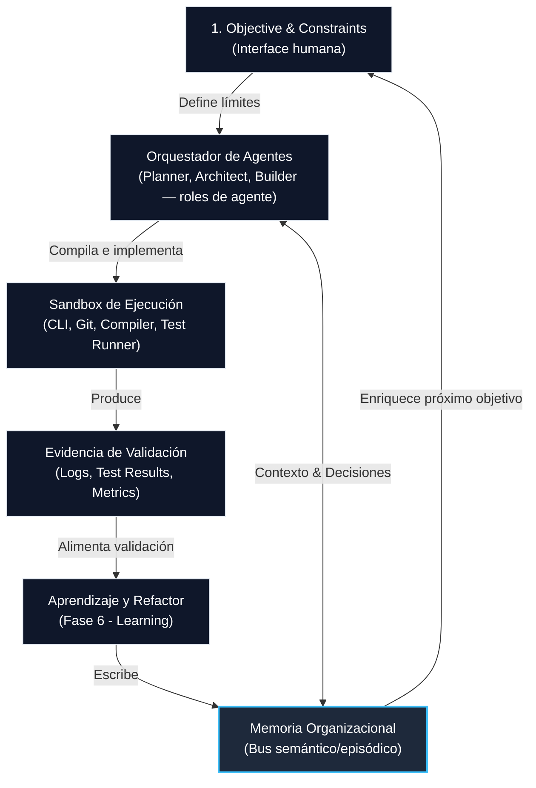

# Cognitive OS — Arquitectura de referencia

El **Cognitive OS** (Sistema Operativo Cognitivo) es la infraestructura tecnológica y el motor de software que implementa los principios de [[HACS]] y el ciclo de vida [[ODLC]]. No es un sistema operativo clásico a nivel de kernel de hardware, sino un entorno de ejecución lógico que coordina humanos, agentes de IA, memoria persistente compartida y gobernanza de código.

La unidad operativa microscópica del Cognitive OS es el [[Agent Loop Engineering|agent loop]]: el ciclo por el cual un agente observa, planifica, actúa con herramientas, interpreta resultados, actualiza estado/memoria y decide si termina, reintenta o escala.

## Diagrama Conceptual del Flujo

El flujo de información en el Cognitive OS es cíclico y centrado en la memoria:

---

## Componentes del Cognitive OS

### 1. Interfaz de Definición (Boundary Layer)
- **Función**: Permite a los humanos establecer objetivos y restricciones ([[Fase 1 - Objective]] y [[Fase 2 - Constraints]]).
- **Mecanismo**: Generación de plantillas YAML formalizadas donde se detallan el impacto, métricas de éxito esperadas y plazos de ejecución.

### 2. Bus de Memoria (Memory Bus)
- **Función**: Almacenamiento persistente estructurado y vectorial de la [[Memoria organizacional]].
- **Mecanismo**: 
  - *Base de datos vectorial* para recuperación por similitud semántica.
  - *Base de datos de grafos* para trazar dependencias de decisiones (ADRs) y dependencias de código.
  - Integración directa con el historial Git del repositorio (los commits y PRs se enlazan con decisiones en la memoria).

### 3. Motor de Orquestación de Agentes (Agent Orchestration Engine)
- **Función**: Ciclo de vida y comunicación de los agentes de IA ([[Roles de agentes]]). *Nota: "Architect" aquí es un [[Roles de agentes|rol de agente]], distinto del [[Roles humanos|rol humano Architect]] — son homónimos con responsabilidades distintas.*
- **Mecanismo**: Arquitectura basada en mensajes. Los agentes leen del Memory Bus, discuten alternativas para proponer la estrategia de ejecución ([[Fase 3 - Strategy]]), y el agente Planner coordina la ejecución en paralelo. El diseño concreto de trigger, goal, state, action policy, observation parser, termination y memory update se formaliza en [[Agent Loop Engineering]].

### 4. Sandbox de Ejecución (Execution Environment)
- **Función**: Entorno aislado donde los agentes interactúan con el mundo físico (bases de datos, terminales, compiladores).
- **Mecanismo**: Contenedores seguros que permiten correr builds de código, tests unitarios, análisis de seguridad y despliegues automáticos a entornos de staging de forma segura.

### 5. Motor de Validación y Observabilidad (Validation Engine)
- **Función**: Colección de evidencias y auditoría de ejecución.
- **Mecanismo**: Monitoreo de telemetría de producción, análisis de logs de errores, y recolección automática de los resultados de negocio para contrastar contra los objetivos originales ([[Fase 5 - Validation]]).

---

## Caso Real de Implementación: Luum Cognitive OS

El motor [luum-cognitive-os](https://github.com/Luum-Home/luum-cognitive-os) es la implementación concreta de esta arquitectura de referencia, desarrollada en colaboración entre **Luum** y **OliveX**. 

### Correspondencia de Componentes:
- **Kernel y Programador de Procesos**: Orquestado por el CLI nativo en Rust (`cos` CLI) que gobierna el ciclo de ejecución humano-agente.
- **Interfaz de Límites y Sandbox**: Implementado mediante ganchos (`PreToolUse` / `PostToolUse`) y scripts de control (`blast-radius.sh` para acotar escrituras y `claim-validator.sh` para forzar ejecución de tests).
- **Bus de Memoria (Memory Bus)**: Integración con **memoria persistente** para el guardado de grafos semánticos, decisiones (ADRs) e historial de incidentes.
- **Base de Políticas (Rules & Governance)**: Ficheros de políticas declarados en la carpeta `policies/` y reglas del repositorio local distribuidas en `rules/`.

---

## Hipótesis

- **H1**: Desacoplar la orquestación lógica del agente (Cognitive OS) del motor de ejecución físico (Sandbox) permite cambiar de modelos de lenguaje (LLMs) sin modificar la arquitectura de referencia.
- **H2**: La velocidad de inicialización del Sandbox es el principal cuello de botella de latencia física en la ejecución de los agentes.

## Decisiones

- **D1**: Toda comunicación entre agentes dentro del orquestador debe realizarse mediante un protocolo de mensajes JSON estructurado y auditable en base a la [[Gobernanza]], prohibiendo la comunicación directa no rastreable.

## Preguntas abiertas

- ¿Cómo evitamos la fragmentación de la memoria semántica cuando se ejecutan múltiples instancias paralelas del Cognitive OS sobre distintas ramas Git de un mismo proyecto?
- ¿Qué nivel de permisos debe tener el Sandbox de ejecución sobre infraestructuras en producción? → [[Gobernanza]]

---
Relacionado: [[HACS]] · [[ODLC]] · [[Memoria organizacional]] · [[Roles de agentes]] · [[Agent Loop Engineering]]
