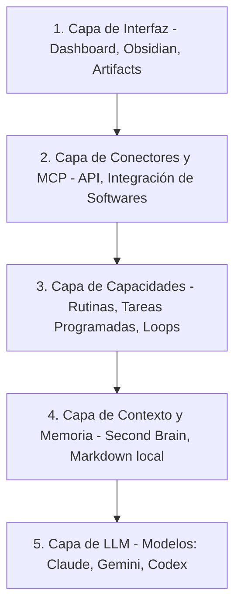

# Análisis — Stop Using Claude Without an Agentic OS

Este documento presenta un análisis y resumen estructurado del video referencial **"Stop Using Claude Without an Agentic OS"** (disponible en [YouTube](https://www.youtube.com/watch?v=1x32W8zAtrg)). El video explora la necesidad de abandonar el uso crudo de modelos de lenguaje aislados y adoptar en su lugar un **Sistema Operativo Agéntico (Agentic OS)** que unifique interfaz, conectores, automatización y memoria persistente.

---

## 1. La Tesis Central

Interactuar con modelos de IA (como Claude o GPT) a través de interfaces de chat genéricas o de la terminal es ineficiente a largo plazo. Para alcanzar la verdadera productividad y la automatización empresarial, es indispensable implementar un **Agentic OS**: un Command Center o panel personalizado que concentre la inteligencia, mantenga la memoria unificada del negocio y permita ejecutar habilidades (skills) interconectadas.

---

## 2. Las 5 Capas de un Agentic OS

El video conceptualiza el funcionamiento de un sistema operativo de inteligencia artificial dividiéndolo en cinco capas lógicas. El modelo se puede contrastar con la [[HACS#Infraestructura mínima|infraestructura mínima de HACS]], que pone el foco en memoria compartida, sandbox, verificación y gobernanza en vez de en la interfaz:

1. **Capa de Interfaz (Interface Layer)**: El centro de mando visual (dashboard) donde el usuario humano y los agentes interactúan, visualizan datos consolidados y gatillan acciones.
2. **Capa de Conectores y MCP (Connector & MCP Layer)**: El puente tecnológico (Model Context Protocol y APIs) que le permite a la IA conectarse con softwares externos (Slack, LinkedIn, Gmail, bases de datos) para leer información y ejecutar acciones.
3. **Capa de Capacidades (Capabilities Layer)**: Las rutinas automáticas, habilidades (skills), tareas programadas y loops agénticos que corren en segundo plano.
4. **Capa de Contexto y Memoria (Context & Memory Layer)**: La base del conocimiento (segundo cerebro). Consiste en directorios locales de archivos Markdown que almacenan de forma estructurada y persistente el contexto del negocio, los objetivos del usuario y los aprendizajes.
5. **Capa de LLM (LLM Layer)**: Los modelos de lenguaje subyacentes (Claude, Gemini, GPT) que procesan las intenciones.

---

## 3. Los 4 Beneficios del Agentic OS

* **Inteligencia y UI Personalizada**: El dashboard se adapta al rol de cada miembro del equipo (ej. panel de ventas para un vendedor, analíticas consolidadas para un manager) mostrando información en tiempo real.
* **Acciones Integradas desde el Dashboard**: Permite al humano gatillar tareas complejas mediante un botón (ej. "Convertir video de YouTube a post de LinkedIn") y delegar la escritura y el envío de respuestas en canales externos directo desde la interfaz.
* **Orquestación de Agentes en Segundo Plano**: Posibilita iniciar chats dedicados, bots conversacionales con contexto del panel actual, o agentes autónomos de ejecución larga sin perder el hilo de la sesión principal.
* **Independencia del Modelo (Model Agnostic)**: Al estar la memoria y las herramientas separadas en capas superiores, el sistema puede cambiar de proveedor de LLM (Claude, GPT, Gemini) de forma transparente sin perder el contexto histórico.

---

## 4. Las 3 Opciones de Implementación (UI Layer)

El autor describe tres caminos arquitectónicos para construir la interfaz del Agentic OS:

### Opción A: Claude Live Artifacts (Artefactos en Vivo)
* **Ventajas**: Rápido de configurar, no requiere conocimientos técnicos de código, y se ejecuta directamente en la interfaz web de Claude.
* **Desventajas**: Según el video, carece de una capa de acción real (no puede gatillar tareas locales o interactuar dinámicamente con software), no es compartible en equipo y tiene limitaciones de personalización de UI.
* **Recomendación**: Ideal para usuarios individuales que inician y solo buscan una visualización interactiva de datos estructurados.

### Opción B: Dashboard en Obsidian (Recomendado para uso personal/local)
* **Ventajas**: Ejecución local barata (corre agentes en modo *headless* sin consumo excesivo de la API pagada), alta flexibilidad de UI, y no requiere servidor web.
* **Cómo se construye**: Se instala la aplicación local Obsidian (segundo cerebro de markdown) y se agregan plugins de comunidad como *Custom JS*, *Data View*, *Shell Commands* y *Terminal* para construir el panel web sobre la carpeta local y ejecutar llamadas al CLI.
* **Recomendación**: La mejor alternativa de balance costo/flexibilidad si el desarrollador o equipo ya utiliza carpetas Markdown locales.

### Opción C: Aplicación Web Standalone (Next.js / React)
* **Ventajas**: Flexibilidad total en diseño, modularidad de componentes y alta capacidad de compartir con equipos o clientes mediante URLs protegidas por contraseña.
* **Desventajas**: Altamente técnico de construir (requiere desarrollo web e integraciones de SDK) y significativamente más caro en ejecución, ya que todas las acciones cognitivas de la app web consumen créditos de la API de pago.
* **Recomendación**: La opción estándar para implementaciones empresariales o portales multi-usuario.

---

## 5. El Enfoque HACS-ODLC (MVP de Interfaz)

El video propone una metodología alineada al quinto valor del [[Manifiesto HACS-ODLC|Gobernanza Humana]] y con [[Fase 6 - Learning|la Fase 6 del ciclo ODLC (Learning)]], donde el aprendizaje e iteración continua son características propias de esa fase, no valores del manifiesto:
- **Primero la Visualización (según el video, 80% del valor)**: No intentes construir el sistema de automatización total el primer día. Empieza diseñando la capa de interfaz para leer y digerir información relevante de tu día.
- **Incorporación de Acciones según Fricción**: Solo agrega botones de ejecución agéntica una vez que identifiques tareas repetitivas y molestas en tu día a día.

---
Relacionado: [[HACS]] · [[Recursos externos]] · [[Memoria organizacional]] · [[Manifiesto HACS-ODLC]]
