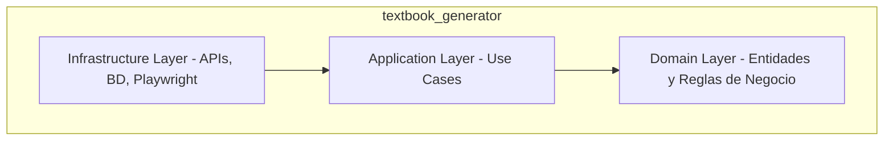

# AI Engineering Lab — Repositorio de Referencia

El **Laboratorio de Ingeniería de IA** (disponible en [MatiasNAmendola/ai-engineering-lab](https://github.com/MatiasNAmendola/ai-engineering-lab)) es un repositorio de referencia central desarrollado bajo una filosofía de primeros principios (*bottom-up*). Su propósito es desmitificar los frameworks comerciales modernos de IA mediante la implementación **desde cero y sin dependencias externas** de las primitivas de inferencia, RAG, runtimes de agentes, observabilidad y gobernanza de seguridad.

Este laboratorio proporciona la base práctica y de código de producción para los cursos de capacitación definidos en [[Cursos HACS-ODLC]].

---

## 1. Estructura del Vault de Conocimiento (Estilo Karpathy)

El repositorio está organizado siguiendo la metodología de **Obsidian Vault / LLM Wiki** recomendada por Andrej Karpathy para bases de código co-mantenidas por agentes de IA:

*   **[CLAUDE.md](../../external/ai-engineering-lab/CLAUDE.md)**: El manual de directrices y rieles operativos en la raíz del proyecto. Define comandos de ejecución rápida (mediante `uv` para Python, `bun` para TypeScript/Node, y Go nativo) e instruye a los agentes sobre cómo estructurar el código y el esquema de testing.
*   **`/raw/`**: Bandeja de entrada inmutable que recopila requisitos brutos, transcripciones y especificaciones de clientes sin procesar.
*   **`/wiki/`**: Base de conocimiento estructurada y destilada, enlazada bidireccionalmente y libre de rutas físicas locales.

---

## 2. Análisis de Primitivas Técnicas (00_primitives_scratch/)

El núcleo educativo del laboratorio reside en sus scripts standalone de Python (~200 líneas), diseñados con principios de simplicidad y responsabilidad única:

### A. Inferencia de LLMs y Protocolos de Red
Implementado en `01_llm_inference_scratch.py`:
- Conexión HTTP cruda a proveedores (OpenAI, Anthropic, Gemini).
- Gestión y parseo de **Server-Sent Events (SSE)** para streaming de texto en tiempo real.
- Estimación precisa de tokens y acumulación de costos en caliente por llamada de modelo.

### B. RAG y PGVector desde Cero
Implementado en `02_rag_postgres_pgvector.py`:
- Cálculo matemático nativo de **Similitud Coseno** en Python puro sin librerías externas (como NumPy o SciPy).
- Estrategias avanzadas de segmentación semántica (*semantic chunking*) basadas en similitud de oraciones contiguas en lugar de límites de caracteres fijos.
- DDL SQL y consultas para integrar y explotar la extensión `pgvector` en **PostgreSQL**, demostrando por qué una base de datos relacional robusta suele ser superior a bases vectoriales dedicadas para el 95% de los proyectos empresariales.

### C. Anatomía de un Agent Runtime
Implementado en `03_agent_runtime_scratch.py`:
- Bucle autónomo **ReAct** (Reasoning and Acting) que interactúa con herramientas de sistema.
- Bus de eventos asíncrono pub-sub para desacoplar las llamadas de los agentes de los flujos de integración.
- Propagación de contexto jerárquico mediante identificadores únicos de solicitud para mantener la trazabilidad de llamadas recursivas y subagentes.

### D. Observabilidad y Evaluaciones (Evals)
Implementado en `04_observability_and_evals.py`:
- Generación de trazas jerárquicas con estructura de spans compatibles con Langsmith y Langfuse.
- Evaluadores automáticos deterministas: *Exact Match* y *Token F1*.
- Evaluador semántico *G-Eval* que utiliza modelos LLM como jueces para calificar la fidelidad, relevancia y coherencia de las respuestas.

### E. Gobernanza y Seguridad de Agentes
Implementado en `05_governance_and_security.py`:
- **ToolGater**: Interceptor a nivel de ejecución que evalúa políticas basadas en roles (RBAC) antes de permitir que un agente invoque herramientas de sistema.
- Redactor y sanitizador automático de PII (información de identificación personal) y secretos del entorno.
- Interruptores de emergencia (*kill switches*) y limitadores presupuestarios diarios a nivel de runtime.

---

## 3. Arquitectura Empresarial: Textbook Generator

Además de las primitivas educativas, el repositorio contiene una aplicación empresarial en producción bajo `textbook_generator/` que implementa **Clean Architecture / SOLID**:

- **Domain Layer**: Contiene las entidades puras (Libro, Capítulo, Secciones) y es totalmente independiente de frameworks de IA y motores de bases de datos.
- **Application Layer**: Define los casos de uso principales de la generación de libros educativos alineados con los planes de estudio.
- **Infrastructure Layer**: Aloja el hosting de bases de datos SQLite y Postgres, las llamadas a APIs de LLM y la interfaz web.

### HITL (Human-in-the-Loop)
La aplicación implementa una cola de revisión de estado donde los humanos (Operadores HACS) validan y editan los capítulos sugeridos por los agentes de IA antes de consolidar la versión final del libro, garantizando la calidad pedagógica y el control de errores.

### Estrategia de Pruebas Automatizadas
El repositorio implementa una pirámide de pruebas completa ejecutable localmente mediante `local_check.sh`:
1.  **Unit Tests**: Pruebas rápidas de funciones y clases.
2.  **Integration Tests**: Pruebas de integración con base de datos.
3.  **E2E de API**: Validaciones de flujos de endpoints HTTP.
4.  **E2E de Navegador con Playwright**: Tests automatizados en Chromium headless que navegan e interactúan con la interfaz real del Textbook Generator, simulando la creación, revisión humana y aprobación de libros.

---

## 4. Alineación con los Cursos HACS-ODLC

El material de este laboratorio es el recurso oficial para las prácticas del programa formativo modular en [[Cursos HACS-ODLC]]:

*   **Módulo 1 (Construcción de agentes)**: Utiliza `01_llm_inference_scratch.py` y `03_agent_runtime_scratch.py` para entender el bucle de razonamiento de agentes.
*   **Módulo 2 (Ingeniería de arneses)**: Utiliza `02_rag_postgres_pgvector.py` y `04_observability_and_evals.py` para analizar el cálculo de métricas de similitud, RAG y trazabilidad de spans.
*   **Módulo 3 (Gobernanza)**: Utiliza `05_governance_and_security.py` para estudiar de forma práctica las políticas de `ToolGater` y los flujos de Human-in-the-Loop en el Textbook Generator.
*   **Módulo 4 (Ciberseguridad aplicada)**: Utiliza los interceptores de seguridad, auditorías de PII y simulaciones de vulnerabilidades locales.
