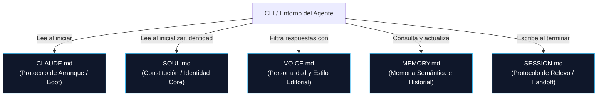

# Especificación de agentes cross-CLI

La **Especificación de agentes cross-CLI** es una especificación técnica de arquitectura lógica para el diseño, comportamiento, personalidad e interoperabilidad de agentes autónomos de software. Este estándar se basa en archivos de configuración planos en formato Markdown colocados en el repositorio de trabajo, permitiendo que múltiples interfaces de línea de comandos (como **Claude Code (Anthropic)**, **OpenClaw**, **Hermes Agent**, **Pi**, **OpenCode**, entre otros) interpreten e implementen la misma identidad del agente y reglas del proyecto de manera consistente.

---

## 1. El Ecosistema de Configuración Basado en Archivos (File-Based Agent Architecture)

En lugar de definir prompts del sistema gigantescos, monolíticos y difíciles de mantener, este estándar modulariza la cognición del agente en archivos especializados con responsabilidades únicas:

### A. `CLAUDE.md` (El Protocolo de Arranque / Boot Protocol)
- **Propósito**: Actúa como el mapa de ruta operativa y técnica local del proyecto.
- **Responsabilidad**: Contiene comandos del sistema para compilar, ejecutar linters, correr pruebas unitarias, convenciones de nomenclatura del código y restricciones del entorno de desarrollo.
- **Funcionamiento**: Los motores CLI leen este archivo en el arranque para saber qué herramientas invocar sin tener que explorar y adivinar la estructura física del repositorio.

### B. `SOUL.md` (La Constitución / Identity Core)
- **Propósito**: Define los límites éticos, de comportamiento y la identidad del agente.
- **Responsabilidad**: Establece "quién" es el agente, sus principios innegociables de razonamiento y qué nivel de autonomía tiene asignado en el proyecto. 
- **Funcionamiento**: Permite mantener la coherencia existencial del agente y evita que se desvíe o se diluya en un chatbot genérico durante sesiones largas.

### C. `VOICE.md` (Personalidad y Estilo Editorial)
- **Propósito**: Regula el comportamiento comunicativo y verbal del agente.
- **Responsabilidad**: Define el tono editorial (cortesía justa, concisión extrema) y prohíbe el uso de "AI Sludge" (las típicas introducciones y disculpas vacías de la IA).
- **Funcionamiento**: Modela el estilo de salida textual, asegurando respuestas claras y directas basadas en hechos y links.

### D. `MEMORY.md` (Memoria Semántica y Hechos)
- **Propósito**: Almacena de forma persistente hechos consolidados sobre el sistema, los usuarios y el dominio.
- **Responsabilidad**: Registra decisiones técnicas aprobadas (ADRs), configuraciones del entorno y aprendizajes pasados para evitar debates repetitivos.
- **Funcionamiento**: Proporciona persistencia cognitiva a largo plazo entre sesiones e instancias independientes.

### E. `SESSION.md` (Protocolo de Relevo / Handoff Protocol)
- **Propósito**: Facilitar la transferencia de tareas y continuidad asincrónica.
- **Responsabilidad**: Al terminar su turno de ejecución, el agente escribe en este archivo un resumen estructurado del trabajo realizado, los bloqueantes encontrados y las directivas específicas para el agente (o humano) que tome el relevo en la siguiente sesión.

---

## 2. Archivos Creados e Interoperabilidad Cross-CLI

Para garantizar que un mismo conjunto de archivos sea utilizable por múltiples clientes de IA, la especificación exige:

1.  **Independencia del Modelo (Model-Agnostic Prompting)**: Evitar el uso de tags o formatos XML/JSON exclusivos de una API (ej. sintaxis propietarias de Anthropic o OpenAI). Las reglas deben escribirse en formato Markdown estándar con viñetas claras y enunciados asertivos directos en tercera persona.
2.  **Mapeo Nativo de Plataforma**: Frameworks como **OpenClaw** incorporan herramientas de importación que buscan el archivo `CLAUDE.md` para extraer y mapear las configuraciones locales directamente dentro de los archivos nativos del agente (`AGENTS.md` o `USER.md`).
3.  **Portabilidad Git**: Al versionar estos archivos markdown dentro del repositorio, cualquier desarrollador o agente que clone el repositorio adquiere instantáneamente la configuración y personalidad del agente unificado.

---

## 3. Principios de Diseño de Instrucciones para Agentes

Al construir y modularizar la documentación e instrucciones del agente, debemos aplicar los siguientes principios de ingeniería cognitiva:

### A. DRY Prompting (Evitar la Repetición de Instrucciones)
- **Principio**: *Don't Repeat Yourself* (No te repitas) adaptado al prompting.
- **Fundamento**: Duplicar reglas de comportamiento o estilos de código en múltiples archivos (`CLAUDE.md`, `SOUL.md`, `VOICE.md`) genera "prompt rot" (putrefacción de instrucciones) y contradicciones cuando una regla se actualiza en un archivo pero se olvida en otro.
- **Aplicación**: Cada regla de comportamiento o comando de sistema debe tener una única fuente de verdad. Si un archivo requiere hacer referencia a una política definida en otro, debe usar un enlace explícito (como a [[Gobernanza]] o [[Roles de agentes]]) o citar la ruta de configuración unificada (ej. `.agent/voice.md`) en lugar de copiar el texto.

### B. Evitar los Viajes al Codebase (Avoiding Codebase Trips)
- **Principio**: Minimizar el escaneo de directorios por parte del agente para entender las convenciones básicas.
- **Fundamento**: Si el agente debe realizar múltiples llamadas a herramientas de búsqueda (`grep`, `list_dir`, `find`) solo para saber cómo correr los tests del proyecto o dónde ubicar un archivo de configuración, se consume un volumen excesivo de tokens y aumenta la latencia operativa del sistema de manera exponencial.
- **Aplicación**: `CLAUDE.md` debe "gritar" de forma clara la estructura del proyecto y los comandos mágicos de desarrollo, actuando como un índice cognitivo estático.

### C. KISS y "Screaming Prompts" (Arquitectura de Agentes que Grita)
- **KISS (Keep It Simple, Stupid)**: Evitar la sobre-ingeniería en las instrucciones. Los prompts no deben estructurarse con variables complejas o flujos conversacionales anidados innecesarios. Deben consistir en tablas de correspondencia directa y listas de viñetas claras de comportamiento binario (Haz esto / No hagas esto).
- **Screaming Architecture (Adaptada a Agentes)**: Acuñado por Robert C. Martin ("Uncle Bob"), este principio establece que la estructura de directorios debe "gritar" el propósito del software. Aplicado a agentes, la estructura de la carpeta de configuración (ej. `.agent/skills/`) debe reflejar inmediatamente las capacidades operativas del agente (ej. `db-migration-skill.md`, `kyc-validation-skill.md`, `security-audit-skill.md`), permitiendo al agente saber qué habilidades tiene disponibles con una sola lectura del directorio.

### D. Optimización Extrema de Tokens (Token Optimization)
- **Principio**: Maximizar la densidad de información por token enviado.
- **Fundamento**: Las ventanas de contexto amplias sufren de degradación de atención ("Lost in the Middle"). Además, las respuestas redundantes o conversacionales de la IA ("AI Sludge") aumentan innecesariamente los costos financieros de API.
- **Aplicación**: 
  - Forzar al agente mediante el `VOICE.md` a omitir introducciones corteses, disculpas redundantes e interacciones vacías.
  - Cargar las instrucciones de habilidades (skills) de manera dinámica bajo demanda (progressive loading) en lugar de enviar todas las especificaciones en cada mensaje.

---

## 4. Referencias y Fuentes Bibliográficas

Para asegurar la validez de este estándar y sus principios, nos basamos en las siguientes referencias y publicaciones técnicas del ecosistema de IA y la ingeniería de software:

1.  **OpenClaw Specification**: Framework oficial e instrucciones para la creación de agentes autónomos persistentes con guías y plantillas para `SOUL.md` y `VOICE.md`.
    -   *Enlace*: [OpenClaw Official Documentation](https://openclaw.ai/docs)
2.  **Anthropic - Claude Code CLI Guidelines**: Documentación oficial del CLI de Claude Code donde se formaliza el uso del archivo `CLAUDE.md` como estándar de arranque de proyectos.
    -   *Enlace*: [Anthropic Claude Code Guide](https://docs.anthropic.com/en/docs/agents-and-tools/claude-code)
3.  **Screaming Architecture (Robert C. Martin)**: Principio de diseño de software sobre el reflejo del propósito de la aplicación en la estructura de archivos.
    -   *Enlace/Referencia*: Robert C. Martin, *Clean Architecture: A Craftsman's Guide to Software Structure and Design* (Prentice Hall, 2017).
4.  **"Lost in the Middle: How Language Models Use Long Contexts" (Liu et al., 2023)**: Paper académico que demuestra empíricamente cómo los LLMs pierden precisión de recuperación cuando los prompts son extensos o la información clave se ubica en el centro de ventanas de contexto saturadas.
    -   *Enlace*: [arXiv:2307.03172](https://arxiv.org/abs/2307.03172)
5.  **DRY Prompts & Prompt Composition**: Análisis y mejores prácticas de ingeniería de software aplicadas a prompts mediante plantillas modulares.
    -   *Enlace*: [DRY Prompts and Modular AI Systems](https://neon.com/blog/dry-prompts-modular-agentic-design)

---
Relacionado: [[Recursos externos]] · [[Roles de agentes]] · [[Gobernanza]] · [[Cognitive OS - Arquitectura de referencia]]
