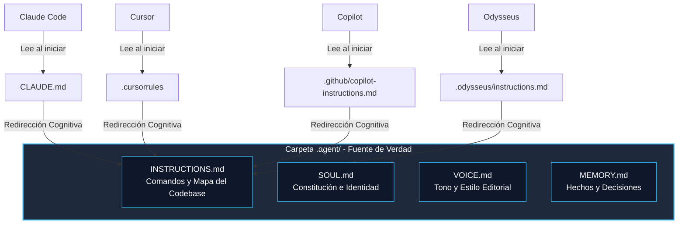

# Especificación de agentes cross-CLI

La **Especificación de agentes cross-CLI** es una especificación técnica de arquitectura lógica para el diseño, comportamiento, personalidad e interoperabilidad de agentes autónomos de software. Este estándar resuelve la fragmentación de herramientas del ecosistema mediante una estructura de archivos desacoplada y un patrón de carga de contexto universal.

---

## 1. El Problema de la Fragmentación en el Ecosistema

Actualmente, las herramientas de desarrollo potenciadas por IA y los CLI de agentes no comparten un único estándar de archivo para inyectar instrucciones locales. Cada plataforma busca un archivo con un nombre propietario en la raíz del repositorio:

| Herramienta / CLI | Archivo Buscado en la Raíz | Estado |
|---|---|---|
| **Claude Code (Anthropic)** | `CLAUDE.md` | Propietario |
| **Cursor IDE** | `.cursorrules` | Propietario |
| **Windsurf IDE** | `.windsurfrules` | Propietario |
| **GitHub Copilot / VS Code** | `.github/copilot-instructions.md` | Propietario |
| **Devin (Cognition)** | `.devin/instructions.md` o `devin.json` | Propietario |
| **OpenClaw** | `.openclaw/USER.md` o `.openclaw/AGENTS.md` | Open Source |
| **Odysseus (PewDiePie)** | `.odysseus/instructions.md` o `cookbook.json` | Local-First |
| **Pi.dev** | `.pi/instructions.md` | Propietario |

Intentar mantener y sincronizar manualmente instrucciones de desarrollo, personalidad y gobernanza en 8 archivos distintos viola el principio de diseño de software **DRY** (Don't Repeat Yourself), provocando "prompt rot" (instrucciones contradictorias e inconsistentes).

---

## 2. La Solución: El Patrón de Redirección Cognitiva (Cognitive Redirection Pattern)

Para resolver esta fragmentación manteniendo una única fuente de verdad, la especificación propone desacoplar los archivos leídos por las plataformas del contenido real de las instrucciones:



### Mecanismo de Funcionamiento
1.  **Carpeta de Verdad (`.agent/`)**: Se crea un directorio oculto en la raíz del proyecto que contiene las notas de comportamiento atómicas (`INSTRUCTIONS.md`, `SOUL.md`, `VOICE.md`, `MEMORY.md`).
2.  **Archivos Adaptadores (Root Adapters)**: En la raíz del repositorio se crean los archivos propietarios mínimos exigidos por cada herramienta (`CLAUDE.md`, `.cursorrules`, etc.).
3.  **Redirección Cognitiva**: Estos archivos adaptadores no contienen código ni guías de estilo. Contienen únicamente una instrucción de redirección escrita en lenguaje natural que obliga al agente de IA (que lee el archivo al arrancar) a invocar su herramienta de lectura sobre la carpeta `.agent/`.

#### Ejemplo de archivo adaptador en la raíz (ej. `CLAUDE.md` o `.cursorrules`):
```markdown
# AI Rules Redirect
AI Instruction: You MUST read the files inside the `.agent/` folder to understand this project's rules, your role, and tone constraints.

Execute your file-viewing tool on:
1. `.agent/INSTRUCTIONS.md` (to learn about make/test/run commands and codebase structure)
2. `.agent/SOUL.md` (to understand your identity core and safety boundaries)
3. `.agent/VOICE.md` (to align with our communication guidelines and avoid AI sludge)
```

Dado que todos los agentes modernos leen el archivo de reglas raíz automáticamente al iniciar la sesión, procesarán esta instrucción y ejecutarán de inmediato la lectura de la fuente de verdad en `.agent/`. Esto evita el uso de enlaces simbólicos (symlinks), que fallan frecuentemente en clonaciones de Git en sistemas Windows si no se configuran privilegios de administrador.

---

## 3. Estructura de la Fuente de Verdad (`.agent/`)

### A. `INSTRUCTIONS.md` (El Mapa del Codebase / Operational Guide)
- **Responsabilidad**: Contiene los comandos del sistema para compilar, testear y desplegar del proyecto, y un mapa semántico de los directorios para evitar que el agente explore a ciegas el sistema de archivos (evitando *Codebase Trips* inútiles).

### B. `SOUL.md` (La Constitución / Identity Core)
- **Responsabilidad**: Define los límites éticos, valores innegociables, nivel de autonomía asignado en el proyecto e instrucciones de seguridad.

### C. `VOICE.md` (Estilo Editorial / Tone)
- **Responsabilidad**: Regula el comportamiento comunicativo, prohíbe las respuestas vacías y el "AI Sludge", y exige concisión extrema orientada a hechos.

### D. `MEMORY.md` (Memoria Semántica y Hechos)
- **Responsabilidad**: Registro de decisiones de arquitectura (ADRs), incidentes de producción históricos y datos estables de negocio.

---

## 4. Principios de Diseño de Instrucciones para Agentes

Al modularizar y redactar las instrucciones dentro de `.agent/`, aplicamos los siguientes principios de ingeniería cognitiva:

### A. DRY Prompting (Evitar la Repetición de Instrucciones)
- **Principio**: *Don't Repeat Yourself* (No te repitas) en prompts.
- **Fundamento**: Duplicar reglas de comportamiento genera contradicciones y desactualización.
- **Aplicación**: Cada directiva debe tener una única ubicación. Para enlazar conceptos de comportamiento, usar wikilinks (como a [[Gobernanza]] o [[Roles de agentes]]) o citar la ruta unificada (ej. `.agent/voice.md`) en lugar de copiar y pegar directivas.

### B. Evitar los Viajes al Codebase (Avoiding Codebase Trips)
- **Principio**: Minimizar el escaneo de directorios por parte del agente para entender convenciones básicas.
- **Fundamento**: Si el agente debe realizar múltiples llamadas a herramientas de búsqueda (`grep`, `list_dir`, `find`) solo para saber cómo correr los tests del proyecto o dónde ubicar un archivo de configuración, se consume un volumen excesivo de tokens y aumenta la latencia operativa del sistema de manera exponencial.
- **Aplicación**: `INSTRUCTIONS.md` debe "gritar" de forma clara la estructura del proyecto y los comandos mágicos de desarrollo, actuando como un índice cognitivo estático.

### C. KISS y "Screaming Prompts" (Screaming Architecture en Prompts)
- **KISS (Keep It Simple, Stupid)**: Evitar la sobre-ingeniería en las instrucciones. Los prompts no deben estructurarse con variables complejas o flujos conversacionales anidados innecesarios. Deben consistir en tablas de correspondencia directa y listas de viñetas claras de comportamiento binario.
- **Screaming Architecture (Adaptada a Agentes)**: Acuñado por Robert C. Martin ("Uncle Bob"), este principio establece que la estructura de directorios debe "gritar" el propósito del software. Aplicado a agentes, la estructura de la carpeta de configuración (ej. `.agent/skills/`) debe reflejar inmediatamente las capacidades operativas del agente (ej. `db-migration-skill.md`, `security-audit-skill.md`), permitiendo al agente saber qué habilidades tiene disponibles con una sola lectura del directorio.

### D. Optimización Extrema de Tokens (Token Optimization)
- **Principio**: Maximizar la densidad de información por token enviado.
- **Fundamento**: Las ventanas de contexto amplias sufren de degradación de atención ("Lost in the Middle"). Además, las respuestas redundantes o conversacionales de la IA ("AI Sludge") aumentan innecesariamente los costos financieros de API.
- **Aplicación**: 
  - Forzar al agente mediante el `VOICE.md` a omitir introducciones corteses, disculpas redundantes e interacciones vacías.
  - Cargar las instrucciones de habilidades (skills) de manera dinámica bajo demanda (progressive loading) en lugar de enviar todas las especificaciones en cada mensaje.

---

## 5. Referencias y Fuentes Bibliográficas

1.  **OpenClaw Specification**: Framework oficial e instrucciones para la creación de agentes autónomos con guías y plantillas para `SOUL.md` y `VOICE.md`.
    -   *Enlace*: [OpenClaw Official Documentation](https://openclaw.ai/docs)
2.  **Anthropic - Claude Code CLI Guidelines**: Documentación oficial del CLI de Claude Code donde se formaliza el uso del archivo `CLAUDE.md` como estándar de arranque de proyectos.
    -   *Enlace*: [Anthropic Claude Code Guide](https://docs.anthropic.com/en/docs/agents-and-tools/claude-code)
3.  **Odysseus Project**: Workspace de IA local y local-first que permite el despliegue autónomo de agentes con acceso a herramientas locales de sistema de archivos y terminal.
    -   *Enlace*: [Odysseus Repository on GitHub](https://github.com/pewdiepie-archdaemon/odysseus)
4.  **Clean Architecture (Robert C. Martin)**: Principio de diseño de software sobre el reflejo del propósito de la aplicación en la estructura de archivos.
    -   *Enlace/Referencia*: Robert C. Martin, *Clean Architecture: A Craftsman's Guide to Software Structure and Design* (Prentice Hall, 2017).
5.  **"Lost in the Middle: How Language Models Use Long Contexts" (Liu et al., 2023)**: Paper académico que demuestra empíricamente cómo los LLMs pierden precisión de recuperación cuando los prompts son extensos o la información clave se ubica en el centro de ventanas de contexto saturadas.
    -   *Enlace*: [arXiv:2307.03172](https://arxiv.org/abs/2307.03172)
6.  **DRY Prompts & Prompt Composition**: Análisis y mejores prácticas de ingeniería de software aplicadas a prompts mediante plantillas modulares.
    -   *Enlace*: [DRY Prompts and Modular Agentic Design](https://neon.com/blog/dry-prompts-modular-agentic-design)

---
Relacionado: [[Recursos externos]] · [[Roles de agentes]] · [[Gobernanza]] · [[Cognitive OS - Arquitectura de referencia]]
