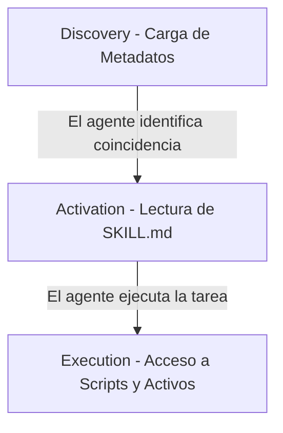

# Repositorios y Catálogos de Skills

En la arquitectura de sistemas cognitivos humano-agente, las **habilidades (skills)** constituyen unidades modulares de lógica, directrices y scripts que amplían dinámicamente las capacidades de los agentes. En lugar de sobrecargar el System Prompt inicial (lo cual consume tokens valiosos y degrada el rendimiento de la ventana de contexto), los arneses modernos cargan e invocan estas habilidades bajo demanda.

Este documento recopila los principales repositorios, sitios web y estándares comunitarios de donde es posible descubrir, descargar e integrar habilidades expertas en el ecosistema.

---

## 1. El Estándar Abierto "Agent Skills"

El estándar **Agent Skills** (originalmente propuesto por Anthropic y ahora adoptado de forma abierta y multiplataforma) define una estructura universal para empaquetar conocimiento procedimental en archivos Markdown y scripts ejecutables.

### Componentes Clave:
*   **[agentskills.io](https://agentskills.io)**: La web oficial del estándar abierto. Contiene la especificación técnica completa y las directrices de diseño para que desarrolladores creen sus propias habilidades portables.
*   **[skills.sh](https://skills.sh)**: El registry público y directorio de la comunidad (el equivalente a "npm" para habilidades de agentes). Permite buscar habilidades por popularidad, categoría (DevOps, testing, frontend) e integrarlas directamente en entornos compatibles.
*   **[vercel-labs/agent-skills](https://github.com/vercel-labs/agent-skills)**: Repositorio oficial mantenido por Vercel. Contiene un conjunto de habilidades preconstruidas y optimizadas para desarrollo web moderno, incluyendo flujos específicos para React, Next.js y configuraciones de infraestructura.

### El Bucle de Carga Progresiva (Three-Tier Loading):
Para mantener la eficiencia de la ventana de contexto de los agentes, las herramientas compatibles con este estándar cargan la información de manera progresiva:



1.  **Discovery (Descubrimiento)**: Al iniciar la sesión, el arnés lee únicamente el nombre y la descripción breve de la habilidad.
2.  **Activation (Activación)**: Si la tarea del usuario coincide con la descripción de la habilidad, el arnés lee el archivo completo `SKILL.md` (instrucciones detalladas y YAML frontmatter).
3.  **Execution (Ejecución)**: El agente accede a los scripts de apoyo (ej. Python, Bash) o recursos de referencia sólo en el momento exacto en que necesita ejecutar una acción determinista.

---

## 2. Awesome Antigravity Skills

**Antigravity Awesome Skills** es la biblioteca curada más grande del ecosistema comunitario de código abierto orientada a dotar a agentes de desarrollo de roles y conocimientos especializados.

*   **Repositorio GitHub**: [sickn33/antigravity-awesome-skills](https://github.com/sickn33/antigravity-awesome-skills)
*   **Portal de Documentación**: [antigravity-awesome-skills Pages](https://sickn33.github.io/antigravity-awesome-skills/)

### Características:
- **Catálogo de más de 1,500 Skills**: Cubre una enorme gama de especializaciones como diseño de software ágil, auditorías de seguridad, administración de bases de datos, despliegue en nube (AWS/GCP), debugging de fugas de memoria y optimización de rendimiento web.
- **Estructuración en Roles**: Las habilidades se encuentran agrupadas para que un agente pueda "ponerse el sombrero" de un rol específico (ej. Ingeniero de Accesibilidad Web, Administrador de Syslogs, Auditor de Contratos Inteligentes).
- **Scripts Incorporados**: La mayoría de las habilidades adjuntan utilidades en Python, Node.js o Bash que el agente puede invocar de forma local para realizar diagnósticos o refactorizaciones automáticas.

---

## 3. El Ecosistema OpenClaw (ClawHub)

**OpenClaw** es un asistente autónomo de inteligencia artificial de código abierto diseñado para correr localmente. Utiliza un formato modular de habilidades altamente compatible con la especificación de Markdown + YAML.

*   **ClawHub**: El registry oficial y descentralizado para descubrir habilidades modulares de la comunidad.
*   **Awesome-OpenClaw-Skills**: Colección curada de las habilidades de automatización más populares de la comunidad, enfocada en:
    - Integraciones de comunicación (Telegram, Discord, Slack) para reportar estados del sistema.
    - Ganchos de integración continua (CI/CD) para compilar y validar código en local.
    - Conectores a servidores de Model Context Protocol (MCP) especializados para Web Scraping y SEO.

---

## 4. Guía de Instalación y Buenas Prácticas

### Instalación vía CLI
La mayoría de los arneses que soportan la especificación estándar de habilidades permiten su descarga e instalación directa mediante el CLI unificado de `skills`:

```bash
# Agregar una habilidad desde un repositorio comunitario
npx skills add <usuario>/<repositorio>

# Ejemplo: instalar las habilidades oficiales de Vercel
npx skills add vercel-labs/agent-skills
```

> [!CAUTION]
> **Seguridad y Confianza en la Ejecución Local**
> Las habilidades no son meramente texto de instrucciones; muchas incluyen scripts de automatización (Bash, JavaScript o Python) que se ejecutan directamente en la terminal local del agente con sus mismos permisos.
>
> **Regla de Gobernanza:** Antes de descargar e instalar una habilidad de repositorios públicos o de terceros:
> 1. Audita el contenido de `SKILL.md` y la carpeta `scripts/`.
> 2. Valida que no realicen llamadas de red sospechosas o comandos destructivos.
> 3. Ejecútalas inicialmente con arneses de pruebas configurados con un radio de impacto restringido o en modo de simulación (`DRY_RUN=true`).
