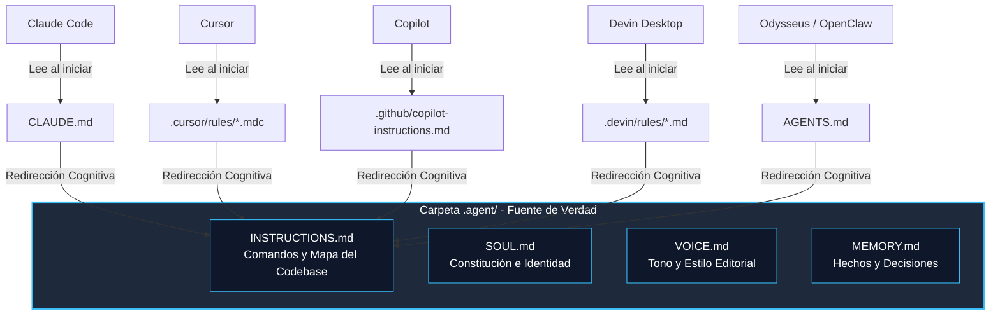

# Especificación de agentes cross-CLI

La **Especificación de agentes cross-CLI** es un patrón propuesto por este vault (no un estándar de la industria) para el diseño, comportamiento, personalidad e interoperabilidad de agentes autónomos de software. Busca reducir la fragmentación de herramientas del ecosistema mediante una estructura de archivos desacoplada y un patrón de carga de contexto común.

> [!warning] Estado de verificación
> Verificado al 2026-06-11: esta especificación es un **patrón HACS-ODLC vendor-neutral**, no una funcionalidad oficial de Claude Cowork. Claude Code documenta subagentes en `.claude/agents/`; OpenClaw documenta el uso de `AGENTS.md`, `SOUL.md`, `USER.md` y memoria. La carpeta `.agent/` de este documento es una capa de normalización propuesta por el vault para evitar duplicación entre herramientas.

---

## 1. El Problema de la Fragmentación en el Ecosistema

Actualmente, las herramientas de desarrollo potenciadas por IA y los CLI de agentes no comparten un único estándar de archivo para inyectar instrucciones locales. Cada plataforma busca un archivo con un nombre propietario en la raíz del repositorio o una carpeta oculta de configuración específica:

| Herramienta / CLI | Archivo Buscado | Ubicación Recomendada | Formato Exigido |
|---|---|---|---|
| **Claude Code (Anthropic)** | `CLAUDE.md` | Raíz del proyecto | Markdown plano |
| **Cursor IDE (Legacy)** | `.cursorrules` | Raíz del proyecto | Markdown plano |
| **Cursor IDE (Moderno)** | Archivo `.mdc` | `.cursor/rules/` | Markdown + YAML Frontmatter |
| **GitHub Copilot / VS Code** | `copilot-instructions.md` | `.github/` | Markdown plano |
| **Devin Desktop (ex-Windsurf)** | Archivo `.md` | `.devin/rules/` | Markdown + YAML Frontmatter (Opcional) |
| **Devin Desktop (Legacy)** | `.windsurfrules` | Raíz del proyecto | Markdown plano (Retrocompatible) |
| **Devin (SaaS / Cloud)** | `AGENTS.md` o `.devin/instructions.md` | Raíz o carpeta oculta | Markdown o JSON |
| **OpenClaw** | `AGENTS.md` o `.openclaw/USER.md` | Raíz o carpeta oculta | Markdown plano |
| **Odysseus (PewDiePie)** | `AGENTS.md` o `.odysseus/instructions.md` ⚠️ | Raíz o carpeta oculta | Markdown plano |
| **Pi.dev** | `AGENTS.md` o `.pi/instructions.md` ⚠️ | Raíz o carpeta oculta | Markdown plano |

*⚠️ Rutas no verificadas (2026-07-28): no se encontró documentación oficial ni código que confirme que Odysseus lea `.odysseus/instructions.md` ni que Pi.dev lea `.pi/instructions.md`. Se dejan en la tabla como conjetura a confirmar, no como comportamiento documentado — el soporte de `AGENTS.md` en ambas herramientas es lo único que corresponde dar por válido hasta contrastarlas contra su documentación.*

*Nota histórica (✅ verificado 2026-06-10 contra el [anuncio oficial de Cognition](https://devin.ai/blog/windsurf-is-now-devin-desktop/)): el 2 de junio de 2026, tras la adquisición de Windsurf por parte de Cognition (creadores de Devin), la aplicación Windsurf fue renombrada a **Devin Desktop** vía actualización over-the-air. El antiguo asistente "Cascade" fue reemplazado por **Devin Local**, un motor reescrito en Rust hasta un 30% más eficiente en tokens (cifra declarada por el proveedor, sin baseline público), con soporte de subagentes y del protocolo abierto ACP.*

Intentar mantener y sincronizar manualmente instrucciones de desarrollo, personalidad y gobernanza en múltiples archivos distintos viola el principio de diseño de software **DRY** (Don't Repeat Yourself), provocando "prompt rot" (instrucciones contradictorias e inconsistentes).

---

## 2. La Solución: El Patrón de Redirección Cognitiva (Cognitive Redirection Pattern)

Para resolver esta fragmentación manteniendo una única fuente de verdad, la especificación propone desacoplar los archivos leídos por las plataformas del contenido real de las instrucciones:



### Mecanismo de Funcionamiento
1.  **Carpeta de Verdad (`.agent/`)**: Se crea un directorio oculto en la raíz del proyecto que contiene notas de comportamiento atómicas (`INSTRUCTIONS.md`, `SOUL.md`, `VOICE.md`, `MEMORY.md`). Esta carpeta es una convención del vault, no un path oficial universal.
2.  **Archivos Adaptadores (Root Adapters)**: En la raíz del repositorio o carpetas ocultas se crean los archivos adaptadores mínimos exigidos por cada herramienta (`CLAUDE.md`, `.cursor/rules/*.mdc`, `AGENTS.md`, etc.).
3.  **Redirección Cognitiva**: Estos archivos adaptadores no contienen reglas duplicadas. Contienen una instrucción de redirección escrita en lenguaje natural para que el agente lea la fuente de verdad del proyecto.
4.  **Compatibilidad explícita**: Cuando una herramienta sí define un formato propio de agentes (por ejemplo, Claude Code en `.claude/agents/`), ese formato debe usarse para subagentes ejecutables; `.agent/` queda como canon documental y de gobernanza, no como sustituto automático del runtime.

---

## 3. Plantillas de Adaptadores Específicas por Herramienta

A continuación se detalla la configuración y el código exacto requerido por cada una de las principales herramientas del ecosistema para enganchar el patrón de redirección cognitiva:

### A. Claude Code (`CLAUDE.md` en la raíz)
```markdown
# Claude Code Rules
AI Instruction: You MUST read the files inside the `.agent/` folder to understand this project's rules, your role, and tone constraints.

Execute your file-viewing tool on:
1. `.agent/INSTRUCTIONS.md` (to learn about build/test/run commands and codebase structure)
2. `.agent/SOUL.md` (to understand your identity core and safety boundaries)
3. `.agent/VOICE.md` (to align with our communication guidelines and avoid AI sludge)
```

### B. Cursor IDE (Moderno: `.cursor/rules/hacs-redirect.mdc`)
Para la versión moderna de Cursor, creamos un archivo `.mdc` dentro de la carpeta `.cursor/rules/` configurado para aplicarse de manera global a todo el espacio de trabajo:
```markdown
---
description: Universal HACS/ODLC agent rule redirector
globs: ["**/*"]
alwaysApply: true
---

# Cursor Rule Redirector
AI Instruction: You MUST read the files inside the `.agent/` folder at the start of your session to understand this project's rules, your role, and tone constraints.

Execute your file-viewing tool on:
1. `.agent/INSTRUCTIONS.md` (for build/test commands and code structure)
2. `.agent/SOUL.md` (for identity and safety rules)
3. `.agent/VOICE.md` (for tone guidelines)
```

*(Si utilizas una versión antigua de Cursor que no soporta la carpeta `.cursor/rules/`, puedes colocar exactamente la misma plantilla de `CLAUDE.md` en un archivo llamado `.cursorrules` en la raíz del proyecto).*

### C. GitHub Copilot / VS Code Chat (`.github/copilot-instructions.md`)
```markdown
# GitHub Copilot Rules
AI Instruction: You MUST read the files inside the `.agent/` folder to understand this project's rules, your role, and tone constraints.

Execute your file-viewing tool on:
1. `.agent/INSTRUCTIONS.md` (to learn about build/test/run commands and codebase structure)
2. `.agent/SOUL.md` (to understand your identity core and safety boundaries)
3. `.agent/VOICE.md` (to align with our communication guidelines and avoid AI sludge)
```

### D. Devin Desktop (Moderno: `.devin/rules/hacs-redirect.md`)
Para el nuevo Devin Desktop (antes Windsurf), el formato recomendado consiste en crear archivos `.md` individuales dentro del directorio `.devin/rules/`:
```markdown
---
description: Universal HACS/ODLC agent rule redirector
globs: ["**/*"]
alwaysApply: true
---

# Devin Local Rule Redirector
AI Instruction: You MUST read the files inside the `.agent/` folder at the start of your session to understand this project's rules, your role, and tone constraints.

Execute your file-viewing tool on:
1. `.agent/INSTRUCTIONS.md` (for build/test commands and code structure)
2. `.agent/SOUL.md` (for identity and safety rules)
3. `.agent/VOICE.md` (for tone guidelines)
```

*(Nota: Devin Desktop mantiene retrocompatibilidad con las reglas declaradas en un único archivo raíz `.windsurfrules`, por lo que si usas ese formato heredado, puedes colocar allí el mismo contenido plano de redirección).*

### E. Devin (Cloud), OpenClaw, Odysseus, Pi.dev (`AGENTS.md` en la raíz)
`AGENTS.md` se ha consolidado en la comunidad de código abierto como el estándar unificado e independiente de herramientas ("El README para Agentes"). 
```markdown
# AGENTS.md
AI Instruction: You MUST read the files inside the `.agent/` folder to understand this project's rules, your role, and tone constraints.

Execute your file-viewing tool on:
1. `.agent/INSTRUCTIONS.md` (to learn about build/test/run commands and codebase structure)
2. `.agent/SOUL.md` (to understand your identity core and safety boundaries)
3. `.agent/VOICE.md` (to align with our communication guidelines and avoid AI sludge)
```

---

## 4. Estructura de la Fuente de Verdad (`.agent/`)

### A. `INSTRUCTIONS.md` (El Mapa del Codebase / Operational Guide)
- **Responsabilidad**: Contiene los comandos del sistema para compilar, testear y desplegar del proyecto, y un mapa semántico de los directorios para evitar que el agente explore a ciegas el sistema de archivos (evitando *Codebase Trips* inútiles).

### B. `SOUL.md` (La Constitución / Identity Core)
- **Responsabilidad**: Define límites, postura, valores innegociables, nivel de autonomía asignado en el proyecto y rasgos estables de identidad. En OpenClaw, `SOUL.md` está documentado como archivo de voz, tono y límites; en HACS-ODLC se eleva a constitución operativa para que los límites de [[Gobernanza]] queden explícitos.

### C. `VOICE.md` (Estilo Editorial / Tone)
- **Responsabilidad**: Regula el comportamiento comunicativo, prohíbe las respuestas vacías y el "AI Sludge", y exige concisión extrema orientada a hechos. Es una separación propia de este patrón: OpenClaw puede concentrar voz en `SOUL.md`, pero el vault la separa para facilitar revisión editorial.

### D. `MEMORY.md` (Memoria Semántica y Hechos)
- **Responsabilidad**: Registro de decisiones de arquitectura (ADRs), incidentes de producción históricos y datos estables de negocio.

---

## 5. Principios de Diseño de Instrucciones para Agentes

Al modularizar y redactar las instrucciones dentro de `.agent/`, aplicamos los siguientes principios de ingeniería cognitiva:

### A. DRY Prompting (Evitar la Repetición de Instrucciones)
- **Principio**: *Don't Repeat Yourself* (No te repitas) en prompts.
- **Fundamento**: Duplicar reglas de comportamiento genera contradicciones y desactualización.
- **Aplicación**: Cada directiva debe tener una única ubicación. Para enlazar conceptos de comportamiento, usar wikilinks (como a [[Gobernanza]] o [[Roles de agentes]]) o citar la ruta unificada (ej. `.agent/VOICE.md`) en lugar de copiar y pegar directivas.

### B. Evitar los Viajes al Codebase (Avoiding Codebase Trips)
- **Principio**: Minimizar el escaneo de directorios por parte del agente para entender convenciones básicas.
- **Fundamento**: Si el agente debe realizar múltiples llamadas a herramientas de búsqueda (`grep`, `list_dir`, `find`) solo para saber cómo correr los tests del proyecto o dónde ubicar un archivo de configuración, se consume un volumen excesivo de tokens y aumenta la latencia operativa del sistema en proporción al número de llamadas.
- **Aplicación**: `INSTRUCTIONS.md` debe "gritar" de forma clara la estructura del proyecto y los comandos mágicos de desarrollo, actuando como un índice cognitivo estático.

### C. KISS y "Screaming Prompts" (Screaming Architecture en Prompts)
- **KISS (Keep It Simple, Stupid)**: Evitar la sobre-ingeniería en las instrucciones. Los prompts no deben estructurarse con variables complejas o flujos conversacionales anidados innecesarios. Deben consistir en tablas de correspondencia directa y listas de viñetas claras de comportamiento binario.
- **Screaming Architecture (Adaptada a Agentes)**: Acuñado por Robert C. Martin ("Uncle Bob"), este principio establece que la estructura de directorios debe "gritar" el propósito del software. Aplicado a agentes, la estructura de la carpeta de configuración (ej. `.agent/skills/`) debe reflejar inmediatamente las capacidades operativas del agente (ej. `db-migration-skill.md`, `kyc-validation-skill.md`, `security-audit-skill.md`), permitiendo al agente saber qué habilidades tiene disponibles con una sola lectura del directorio.

### D. Optimización Extrema de Tokens (Token Optimization)
- **Principio**: Maximizar la densidad de información por token enviado.
- **Fundamento**: Las ventanas de contexto amplias sufren de degradación de atención ("Lost in the Middle"). Además, las respuestas redundantes o conversacionales de la IA ("AI Sludge") aumentan innecesariamente los costos financieros de API.
- **Aplicación**: 
  - Forzar al agente mediante el `VOICE.md` a omitir introducciones corteses, disculpas redundantes e interacciones vacías.
  - Cargar las instrucciones de habilidades (skills) de manera dinámica bajo demanda (progressive loading) en lugar de enviar todas las especificaciones en cada mensaje.

---

## 6. Referencias y Fuentes Bibliográficas

1.  **OpenClaw Workspace / SOUL.md**: Documentación oficial de OpenClaw sobre `SOUL.md` como archivo de voz, límites y personalidad, y `AGENTS.md` como reglas operativas con lectura de memoria.
    -   *Enlaces*: [SOUL.md personality guide](https://docs.openclaw.ai/concepts/soul), [Default AGENTS.md](https://docs.openclaw.ai/reference/AGENTS.default) (verificado 2026-06-11)
2.  **Anthropic - Claude Code subagents**: Documentación oficial donde se formaliza el uso de `.claude/agents/` y `~/.claude/agents/` para subagentes con prompt, herramientas y permisos propios.
    -   *Enlace*: [Claude Code subagents](https://docs.anthropic.com/en/docs/claude-code/sub-agents) (verificado 2026-06-11)
3.  **Claude Cowork**: Documentación oficial de disponibilidad y alcance de Cowork; relevante para distinguir Cowork de la carpeta `.agent/` propuesta por este vault.
    -   *Enlace*: [Get started with Claude Cowork](https://support.claude.com/en/articles/13345190-get-started-with-claude-cowork) (verificado 2026-06-11)
4.  **Devin Desktop Rebranding Announcement (Cognition AI)**: Lanzamiento de Devin Desktop integrando la tecnología de Windsurf y el nuevo motor Devin Local en Rust.
    -   *Enlace*: [Windsurf is now Devin Desktop (Cognition)](https://devin.ai/blog/windsurf-is-now-devin-desktop/) (verificado 2026-06-10)
5.  **Odysseus Project**: Workspace de IA local y local-first que permite el despliegue autónomo de agentes con acceso a herramientas locales de sistema de archivos y terminal.
    -   *Enlace*: [Odysseus Repository on GitHub](https://github.com/odysseus-dev/odysseus) (licencia AGPL-3.0; el repo se movió desde `pewdiepie-archdaemon/odysseus`, verificado 2026-10-07 con `curl -s https://api.github.com/repos/odysseus-dev/odysseus`)
6.  **Clean Architecture (Robert C. Martin)**: Principio de diseño de software sobre el reflejo del propósito de la aplicación en la estructura de archivos.
    -   *Enlace/Referencia*: Robert C. Martin, *Clean Architecture: A Craftsman's Guide to Software Structure and Design* (Prentice Hall, 2017).
7.  **"Lost in the Middle: How Language Models Use Long Contexts" (Liu et al., 2023)**: Paper académico que demuestra empíricamente cómo los LLMs pierden precisión de recuperación cuando los prompts son extensos o la información clave se ubica en el centro de ventanas de contexto saturadas.
    -   *Enlace*: [arXiv:2307.03172](https://arxiv.org/abs/2307.03172)
8.  **DRY Prompts & Prompt Composition**: Análisis y mejores prácticas de ingeniería de software aplicadas a prompts mediante plantillas modulares.
    -   *Enlace*: [DRY Prompts and Modular Agentic Design](https://neon.com/blog/dry-prompts-modular-agentic-design) (enlace caído, 404 al 2026-10-07)
9.  **AGENTS.md Community Standard**: Iniciativa de código abierto para estandarizar archivos de instrucciones unificados para agentes de IA en repositorios de código.
    -   *Enlace*: [AGENTS.md Specification and Usage](https://github.com/agentsmd/agents.md) (repositorio canónico verificado 2026-10-07: `github.com/openai/agents.md` redirige ahí; la URL previa `github.com/agents-md/agents.md` devuelve 404)

---
Relacionado: [[Recursos externos]] · [[Roles de agentes]] · [[Gobernanza]] · [[Agent Loop Engineering]]
